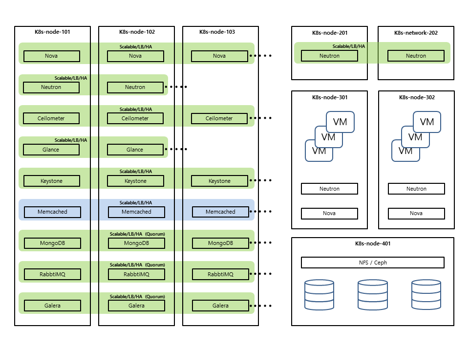

OpenStack on Kubernetes (OaaS)
================================

# 머릿글

* OaaS는 "OpenStack as a Service"를 뜻함.
* Kubernetes(이하 k8s)의 기능을 활용하여, 탄력적인 OpenStack 환경을 쉽게 구축/운영하고, 업데이트 및 장애상황에도 유연하게 대응할 수있는 솔루션을 목표로 함.
* **(Note)현 상태는 1차 개발 단계로서, Controller부에 속한 컴포넌트들 위주로 작업중...**

# 레이아웃

# 특징

* 일반적으로 OpenStack의 Controller라 불리는 부분의 주요 컴포넌트들을 k8s의 Pod단위로 분리/배치하여 운용.
* 각 Pod들은 독립적인 Scalable과 LB/HA 가능.

# v0.0.1

* OpenStack Controller의 컴포넌트들을 k8s상에서 배포 완료.

<pre>
- memcached (완료)
- rabbitmq (완료)
- mongodb (완료)
- etcd (완료)
- galera (완료)
- haproxy (완료)
- keystone (완료)
- glance (완료)
- nova
- neutron
- cinder
- heat
- ceilometer
- horizon
</pre>
