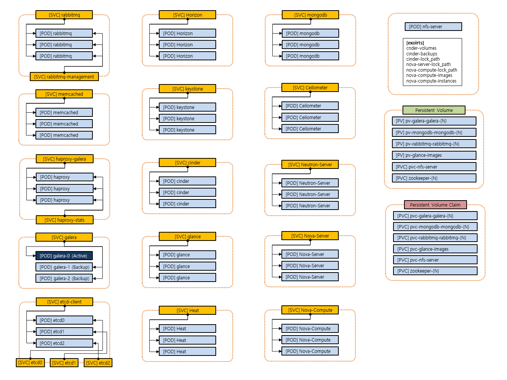
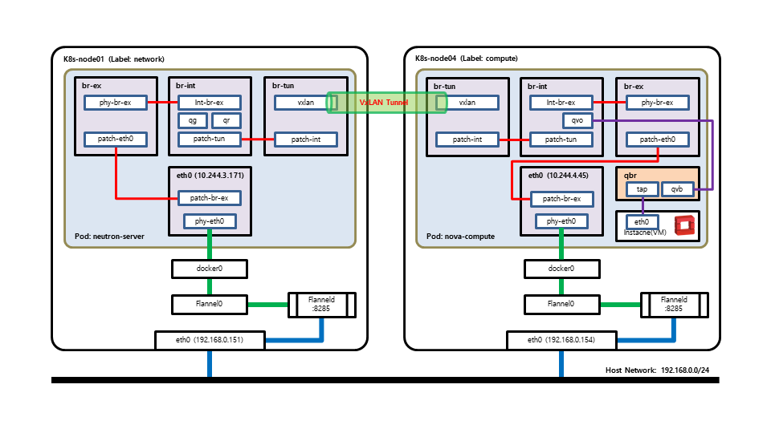
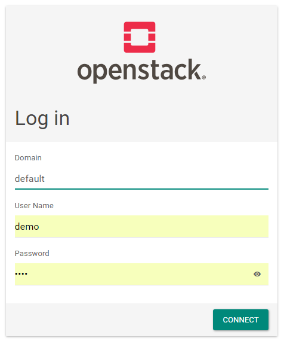
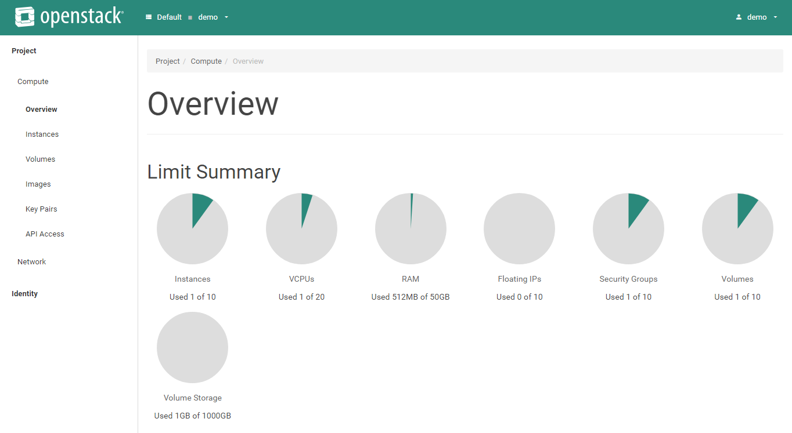
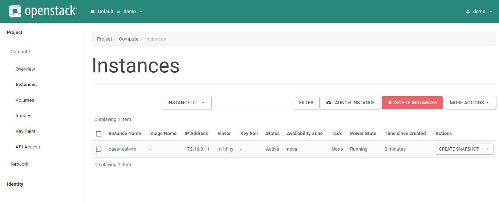
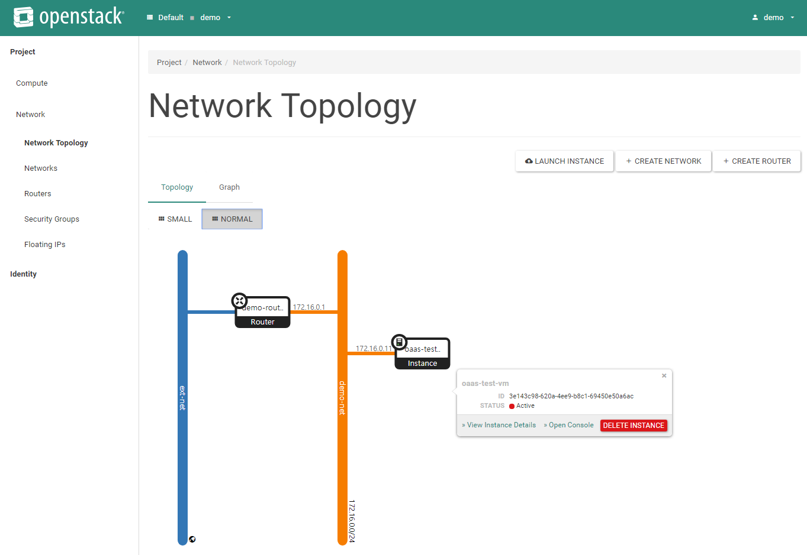
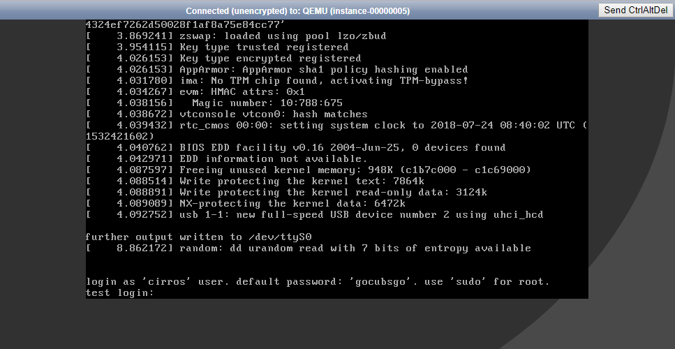

OpenStack on Kubernetes (OaaS)
================================

# Greetings

> Hi! all, Welcome to my project. I hope this will be useful thing. :)

> p.s. And I hope that some guy help me. If you are interested in this, please contact me. thank you.

Intro
================================

* **OaaS** is "**OpenStack as a Service**".

* MAINTAINER: Jung-In.Jung (call518@gmail.com)
* 2018-06-20 ~ Now

### Goals

* Auto-Provisioning OpenStack, Based on Kubernetes(k8s).
* Scalaing for LB/HA.
* Supoort Provisioning Almost OpenStack Releases. (Newton/Ocata/Pike/Queens/...)
* Simple and Dynamic Configuration.
* Auto Failover/Failback.

### Components Diagram



### Networking Diagram



### Progress

* Ocata
  * **memcached** (Completed)
  * **rabbitmq** (Completed)
  * **mongodb** (Completed)
  * **etcd** (Completed)
  * **galera** (Completed)
  * **haproxy** (Completed)
  * **keystone** (Completed)
  * **glance** (Completed)
  * **nova** (Completed)
  * **neutron** (Completed)
  * **cinder** (Completed)
  * **heat** (Completed)
  * **ceilometer-central** (Completed)
  * **aodh** (Completed)
  * **horizon** (Completed)
* Integration of OpenStack Releases.
  * (TODO: Planning...)


Tutorial
================================

## System Env. & Arch.

### Requirements.

* General Kubernetes Cluster.
  * [kubernetes Installation guide](https://www.howtoforge.com/tutorial/centos-kubernetes-docker-cluster/)
* All k8s Worker nodes have to sync Time (e.g. chrony, ntp)
* k8s worker nodes for neutron-server/nova-compute need to load openvswitch/ebtables/ip_vs kernel module.
  * Run contents of **host_kernel_modules_for_oaas.sh** on compute/network role(label) woker nodes.
* Quorum PODs (Replica is  have to **2n+1**)
  * galera-etcd
  * galera
  * rabbitmq

### Env.

(Note) We have tested this tutorial with **6 VMs** on VirtualBox Env. If u want, any env is possible. (eg. physical machines)

(Note) We use NFS for cinder backend storage for simple tutorial, but soon we will change to ceph back-end storage.

#### Spec. of Physical Host

* Processor: Intel Core i5-6500 (3.2GHz)
* Memory: 32GB
* Storage: SSD (2TB)
* NIC: Intel(R) Ethernet Connection (5) I219-LM

#### Spec. of each VM

(Note) Maybe, you need big RAM. if not, reduce number of replicas.

* CentOS-7 x86_64
* 2 EA vCPUs
* vRAM: 2GB ~ 6GB
* 100 GB vDisk
* 1 EA NIC

#### Spec. of k8s

> This is versions of packages that i have tested.

* docker-ce-18.06.0.ce-3.el7.x86_64
* kubernetes-cni-0.6.0-0.x86_64
* kubectl-1.11.1-0.x86_64
* kubelet-1.11.1-0.x86_64
* kubeadm-1.11.1-0.x86_64

#### VM OS Env.

##### /etc/hosts

```bash
# cat /etc/hosts

192.168.0.150 k8s-master
192.168.0.151 k8s-node01
192.168.0.152 k8s-node02
192.168.0.153 k8s-node03
192.168.0.154 k8s-node04
192.168.0.155 k8s-node05
```

## Deploy Tutorial

#### Node Labels (Role)

(!) Network(neutron-sever) worker nodes must be separated/dedicated. (network=true)

```bash
[k8s-master]# kubectl get node --show-labels

NAME         STATUS    ROLES     AGE       VERSION   LABELS
k8s-master   Ready     master    8d        v1.11.1   node-role.kubernetes.io/master=
k8s-node01   Ready     <none>    8d        v1.11.1   controller=true,compute=true,nfs-server=true
k8s-node02   Ready     <none>    8d        v1.11.1   controller=true,compute=true
k8s-node03   Ready     <none>    8d        v1.11.1   controller=true,compute=true
k8s-node04   Ready     <none>    8d        v1.11.1   network=true
k8s-node05   Ready     <none>    8d        v1.11.1   network=true
```

#### default configs (eg. password)

check main env file, **src-ocata/configMap-env-common.yaml**

```yaml
apiVersion: v1
kind: ConfigMap
metadata:
  name: env-common
data:
  K8S_OPENSTACK_RELEASE: "ocata"
  MYSQL_ROOT_PASSWORD: "passw0rd"
  DISCOVERY_SERVICE: "etcd-client:2379"
  XTRABACKUP_PASSWORD: "passw0rd"
  CLUSTER_NAME: "mariadb_galera_ss"
  #MYSQL_DATABASE: "mydatabase"
  #MYSQL_USER: "myuser"
  MYSQL_PASSWORD: "passw0rd"
  K8S_MONGO_USER: "admin"
  K8S_MONGO_PASS: "passw0rd"
  K8S_KEYSTONE_DB_PASS: "passw0rd"
  K8S_GLANCE_DB_PASS: "passw0rd"
  K8S_CINDER_DB_PASS: "passw0rd"
  K8S_NEUTRON_DB_PASS: "passw0rd"
  K8S_NOVA_DB_PASS: "passw0rd"
  K8S_GNOCCHI_DB_PASS: "passw0rd"
  K8S_AODH_DB_PASS: "passw0rd"
  K8S_HEAT_DB_PASS: "passw0rd"
  K8S_KEYSTONE_USER_ADMIN_PASS: "passw0rd"
  K8S_KEYSTONE_USER_DEMO_PASS: "demo"
  K8S_KEYSTONE_USER_GLANCE_PASS: "passw0rd"
  K8S_KEYSTONE_USER_CINDER_PASS: "passw0rd"
  K8S_KEYSTONE_USER_NEUTRON_PASS: "passw0rd"
  K8S_KEYSTONE_USER_NOVA_PASS: "passw0rd"
  K8S_KEYSTONE_USER_PLACEMENT_PASS: "passw0rd"
  K8S_KEYSTONE_USER_GNOCCHI_PASS: "passw0rd"
  K8S_KEYSTONE_USER_CEILOMETER_PASS: "passw0rd"
  K8S_KEYSTONE_USER_AODH_PASS: "passw0rd"
  K8S_KEYSTONE_USER_HEAT_PASS: "passw0rd"
  K8S_HAPROXY_STATS_USERNAME: "admin"
  K8S_HAPROXY_STATS_PASSWORD: "passw0rd"
  K8S_RABBITMQ_ADMIN_USER: "admin"
  K8S_RABBITMQ_ADMIN_PASS: "passw0rd"
  K8S_RABBITMQ_OPENSTACK_USER: "openstack"
  K8S_RABBITMQ_OPENSTACK_PASS: "passw0rd"
  K8S_METADATA_PROXY_SHARED_SECRET: "QU6muuXhU4oAeLzDas6obGsDtoFNZTHq"
  K8S_NFS_SERVER_IP_ETC_KEY: "k8s-oaas-nfs-server-ip-address"
  K8S_EXT_SUBNET_CIDR: "192.168.100.0/24"
  K8S_EXT_SUBNET_POOL_START: "192.168.100.101"
  K8S_EXT_SUBNET_POOL_END: "192.168.100.200"
  K8S_EXT_SUBNET_GW: "192.168.100.1"
  K8S_DEMO_SUBNET_CIDR: "172.16.0.0/24"
  K8S_DEMO_SUBNET_GW: "172.16.0.1"
  K8S_DEMO_SUBNET_DNS: "8.8.8.8"
```

### Required Docker Images.

* call518/oaas-init-container
* call518/oaas-nfs-server
* call518/oaas-etcd
* call518/oaas-galera
* call518/oaas-memcached
* call518/oaas-rabbitmq
* call518/oaas-mongodb
* call518/oaas-haproxy
* call518/oaas-zookeeper
* call518/oaas-ocata

### Setup Kernel Modules on Worker Nodes ###

run host_kernel_modules_for_oaas.sh or below on all worker nodes.

```bash
# cat > /etc/modules-load.d/oaas.conf << EOF
openvswitch
ebtables
ip_vs
EOF

# modprobe openvswitch
# modprobe ebtables
# modprobe ip_vs
```

### Initiate Deploying OpenStack

```bash
[k8s-master]# git clone [here]

[k8s-master]# cd OpenStack-on-Kubernetes/src-ocata

[k8s-master]# ./start-oaas.sh
```

### Result Deploying

```bash
[k8s-master]# kubectl get all -o wide

NAME                           READY     STATUS    RESTARTS   AGE       IP             NODE
pod/cinder-0                   1/1       Running   0          38m       10.244.3.130   k8s-node03
pod/cinder-1                   1/1       Running   0          6m        10.244.1.143   k8s-node01
pod/etcd0                      1/1       Running   0          38m       10.244.2.112   k8s-node02
pod/etcd1                      1/1       Running   0          38m       10.244.3.127   k8s-node03
pod/etcd2                      1/1       Running   0          38m       10.244.1.137   k8s-node01
pod/galera-0                   1/1       Running   1          38m       10.244.2.117   k8s-node02
pod/galera-1                   1/1       Running   0          17m       10.244.3.133   k8s-node03
pod/galera-2                   1/1       Running   1          33m       10.244.1.142   k8s-node01
pod/glance-0                   1/1       Running   0          38m       10.244.1.140   k8s-node01
pod/glance-1                   1/1       Running   0          10m       10.244.3.135   k8s-node03
pod/haproxy-7b567f67d8-mxm7v   1/1       Running   3          38m       10.244.3.128   k8s-node03
pod/horizon-6965547f56-kgc44   1/1       Running   0          38m       10.244.2.116   k8s-node02
pod/keystone-0                 1/1       Running   0          38m       10.244.2.114   k8s-node02
pod/keystone-1                 1/1       Running   0          13m       10.244.3.134   k8s-node03
pod/memcached-0                1/1       Running   0          38m       10.244.2.113   k8s-node02
pod/memcached-1                1/1       Running   0          38m       10.244.3.129   k8s-node03
pod/memcached-2                1/1       Running   0          38m       10.244.1.138   k8s-node01
pod/neutron-server-0           1/1       Running   0          38m       10.244.1.139   k8s-node01
pod/neutron-server-1           1/1       Running   0          5m        10.244.3.136   k8s-node03
pod/nfs-server                 1/1       Running   0          38m       10.244.1.136   k8s-node01
pod/nova-compute-0             1/1       Running   0          38m       10.244.4.24    k8s-node04
pod/nova-compute-1             1/1       Running   0          38m       10.244.5.24    k8s-node05
pod/nova-server-0              1/1       Running   0          38m       10.244.2.115   k8s-node02
pod/nova-server-1              1/1       Running   0          4m        10.244.1.144   k8s-node01
pod/rabbitmq-0                 1/1       Running   0          38m       10.244.3.131   k8s-node03
pod/rabbitmq-1                 1/1       Running   0          35m       10.244.1.141   k8s-node01
pod/rabbitmq-2                 1/1       Running   0          35m       10.244.2.118   k8s-node02

NAME                          TYPE        CLUSTER-IP       EXTERNAL-IP   PORT(S)                                                       AGE       SELECTOR
service/cinder                ClusterIP   None             <none>        8776/TCP                                                      38m       app=cinder
service/etcd-client           ClusterIP   10.109.90.101    <none>        2379/TCP                                                      38m       app=etcd
service/etcd0                 ClusterIP   10.110.11.231    <none>        2379/TCP,2380/TCP                                             38m       etcd_node=etcd0
service/etcd1                 ClusterIP   10.98.35.253     <none>        2379/TCP,2380/TCP                                             38m       etcd_node=etcd1
service/etcd2                 ClusterIP   10.110.157.230   <none>        2379/TCP,2380/TCP                                             38m       etcd_node=etcd2
service/galera                ClusterIP   None             <none>        3306/TCP                                                      38m       app=galera
service/glance                ClusterIP   None             <none>        9292/TCP,9191/TCP                                             38m       app=glance
service/haproxy-galera        ClusterIP   None             <none>        3306/TCP                                                      38m       app=haproxy
service/haproxy-stats         NodePort    10.103.245.255   <none>        9000:30090/TCP                                                38m       app=haproxy
service/horizon               NodePort    10.103.67.208    <none>        80:30080/TCP                                                  38m       app=horizon
service/keystone              ClusterIP   None             <none>        5000/TCP,35357/TCP                                            38m       app=keystone
service/kubernetes            ClusterIP   10.96.0.1        <none>        443/TCP                                                       2d        <none>
service/memcached             ClusterIP   None             <none>        11211/TCP                                                     38m       app=memcached
service/neutron-server        ClusterIP   None             <none>        9696/TCP                                                      38m       app=neutron-server
service/nova-compute          ClusterIP   None             <none>        8774/TCP,8775/TCP,6080/TCP                                    38m       app=nova-compute
service/nova-server           NodePort    10.111.84.90     <none>        8774:30177/TCP,8778:30246/TCP,8775:31964/TCP,6080:30068/TCP   38m       app=nova-server
service/rabbitmq              ClusterIP   None             <none>        5672/TCP,4369/TCP,25672/TCP                                   38m       app=rabbitmq
service/rabbitmq-management   ClusterIP   None             <none>        15672/TCP                                                     38m       app=rabbitmq

NAME                      DESIRED   CURRENT   UP-TO-DATE   AVAILABLE   AGE       CONTAINERS   IMAGES                 SELECTOR
deployment.apps/haproxy   1         1         1            1           38m       haproxy      call518/oaas-haproxy   app=haproxy
deployment.apps/horizon   1         1         1            1           38m       horizon      call518/oaas-ocata     app=horizon

NAME                                 DESIRED   CURRENT   READY     AGE       CONTAINERS   IMAGES                 SELECTOR
replicaset.apps/haproxy-7b567f67d8   1         1         1         38m       haproxy      call518/oaas-haproxy   app=haproxy,pod-template-hash=3612392384
replicaset.apps/horizon-6965547f56   1         1         1         38m       horizon      call518/oaas-ocata     app=horizon,pod-template-hash=2521103912

NAME                              DESIRED   CURRENT   AGE       CONTAINERS       IMAGES
statefulset.apps/cinder           2         2         38m       cinder           call518/oaas-ocata
statefulset.apps/galera           3         3         38m       galera           call518/oaas-galera
statefulset.apps/glance           2         2         38m       glance           call518/oaas-ocata
statefulset.apps/keystone         2         2         38m       keystone         call518/oaas-ocata
statefulset.apps/memcached        3         3         38m       memcached        call518/oaas-memcached
statefulset.apps/neutron-server   2         2         38m       neutron-server   call518/oaas-ocata
statefulset.apps/nova-compute     2         2         38m       nova-compute     call518/oaas-ocata
statefulset.apps/nova-server      2         2         38m       nova-server      call518/oaas-ocata
statefulset.apps/rabbitmq         3         3         38m       rabbitmq         call518/oaas-rabbitmq
```

### Open Horizon Dashboard

> In browser, **http://[One_of_worker_nodes]:30080**

### Scaling

> (Note) Maybe, needed more worker nodes...

```bash
<Examples>

[k8s-master]# kubectl scale --replicas=4 statefulset.apps/cinder
[k8s-master]# kubectl scale --replicas=5 statefulset.apps/galera (must 2n+1)
```

### ScreenShots

#### Login


#### Overview


#### Instances


#### Network Topology


#### Instance Web Console


TODO
================================

* Re-Configuration Flat-IP Ranbe for EXT-NET.
* (Done) ~~Simplify initContainer Check-Processing.~~
* Integration of All of Provision Source. /w Template and ETc...


Appendix
================================

## Repositories

#### Active Repository (GitHub)
https://github.com/call518/OpenStack-on-Kubernetes

#### Mirrored Repository (GitLab)
https://gitlab.com/call518/OpenStack-on-Kubernetes

## References

* HAProxy
  * https://blog.bluematador.com/posts/running-haproxy-docker-containers-kubernetes/
* MongoDB
  * https://www.ibm.com/developerworks/cloud/library/cl-deploy-mongodb-replica-set-using-ibm-cloud-container-service/index.html
  * https://github.com/MichaelScript/kubernetes-mongodb
  * https://github.com/MichaelScript/kubernetes-mongodb/blob/master/mongodb.yaml
