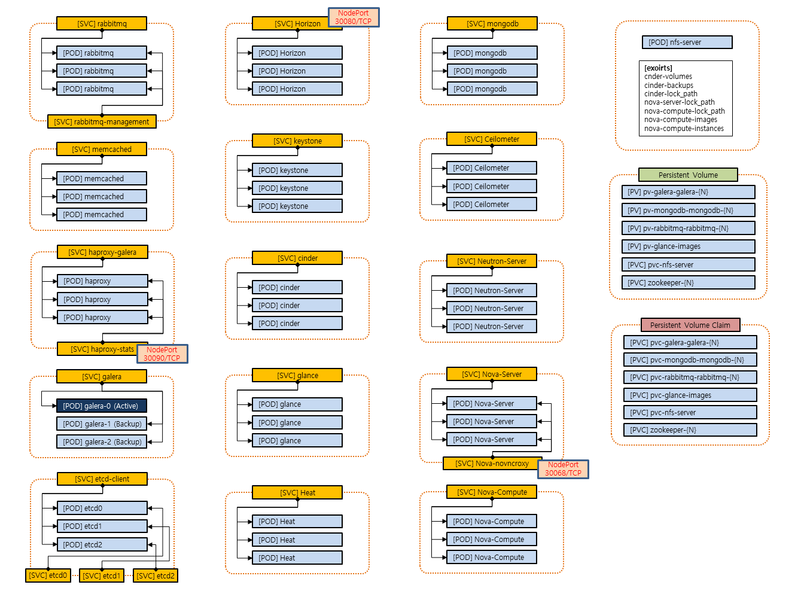
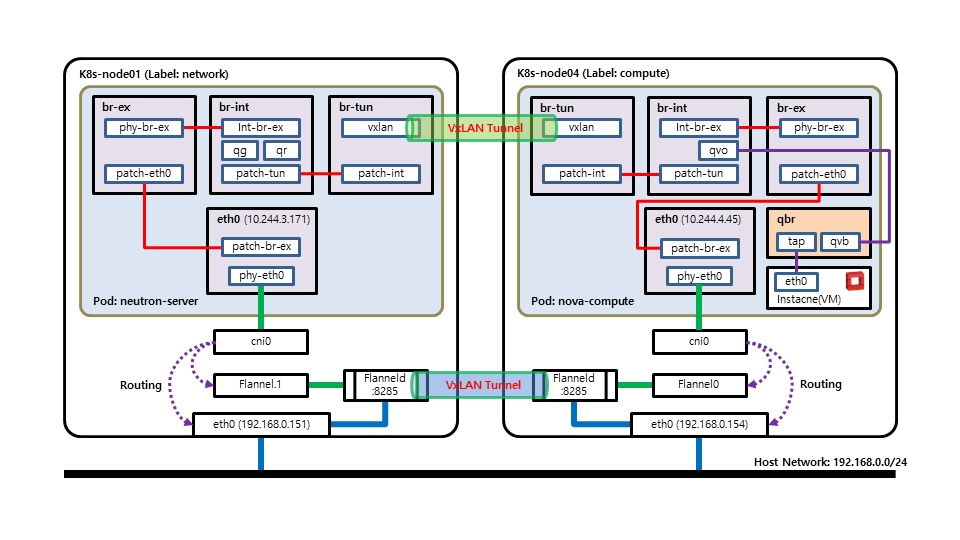

OpenStack on Kubernetes (OaaS)
================================

* MAINTAINER: Jung-In.Jung (call518@gmail.com)
* Term: 2018-06-20 ~ (ongoing...)


Intro
================================

* **OaaS** is "**OpenStack as a Service**".

### Features

* Auto-Provisioning Based on Kubernetes(k8s).
* Micro-Service for Scalable LB/HA.
* Support Many OpenStack Releases. (Newton/Ocata/Pike/Queens/...)
* Simple and Dynamic Configuration.
* Auto Failover/Failback.

### Components Diagram



### Networking Diagram



### Current Status

* **memcached** (Completed)
* **rabbitmq** (Completed)
* **mongodb** (Completed)
* **etcd** (Completed)
* **galera** (Completed)
* **haproxy** (Completed)
* **keystone** (Completed)
* **glance** (Completed)
* **nova** (Completed)
* **neutron** (Completed)
* **cinder** (Completed)
* heat (TODO)
* ceilometer (TODO)
* **horizon** (Completed)


Tutorial
================================

## System Env. & Arch.

### System Diagram

(TODO - Diagram)

### Env.

> (Note) I'm now testing/developing with 6 VMs on VirtualBox Env. If u want, any env is possible. (eg. physical machines)

#### Spec. of each VM

> (Note) Maybe, you need much RAM. if not, reduce number of replicas.

* OS CentOS7 x86_64
* 2EA vCPUs
* 8G vRAM
* 100GB vDisk
* 1EA NIC

#### Spec. of K8S

> This is just version that i have tested.
> (Note) [Instation guide of k8s](https://www.howtoforge.com/tutorial/centos-kubernetes-docker-cluster/)

* docker-ce-18.06.0.ce-3.el7.x86_64
* kubernetes-cni-0.6.0-0.x86_64
* kubectl-1.11.1-0.x86_64
* kubelet-1.11.1-0.x86_64
* kubeadm-1.11.1-0.x86_64

#### VM OS Env.

##### /etc/hosts

```bash
# cat /etc/hosts

192.168.0.150 k8s-master
192.168.0.151 k8s-node01
192.168.0.152 k8s-node02
192.168.0.153 k8s-node03
192.168.0.154 k8s-node04
192.168.0.155 k8s-node05
```

#### k8s node info

```bash
[k8s-master]# kubectl get nodes

NAME         STATUS    ROLES     AGE       VERSION
k8s-master   Ready     master    18h       v1.11.1
k8s-node01   Ready     <none>    18h       v1.11.1
k8s-node02   Ready     <none>    18h       v1.11.1
k8s-node03   Ready     <none>    18h       v1.11.1
k8s-node04   Ready     <none>    18h       v1.11.1
k8s-node05   Ready     <none>    18h       v1.11.1
```

## Deploy Tutorial

> (Note) Now, OpenStack Release is separated. but soon all will be integrated by yaml template.

#### Requirements

* Quorum PODs (Replica is  have to **2n+1**)
 * galera-etc
 * galera
 * rabbitmq

#### default configs (eg. password)

edit, src-ocata/configMap-env-common.yaml

```yaml
apiVersion: v1
kind: ConfigMap
metadata:
  name: env-common
data:
  MYSQL_ROOT_PASSWORD: "passw0rd"
  DISCOVERY_SERVICE: "etcd-client:2379"
  XTRABACKUP_PASSWORD: "passw0rd"
  CLUSTER_NAME: "mariadb_galera_ss"
  #MYSQL_DATABASE: "mydatabase"
  #MYSQL_USER: "myuser"
  MYSQL_PASSWORD: "passw0rd"
  K8S_MONGO_USER: "admin"
  K8S_MONGO_PASS: "passw0rd"
  K8S_KEYSTONE_DB_PASS: "passw0rd"
  K8S_GLANCE_DB_PASS: "passw0rd"
  K8S_CINDER_DB_PASS: "passw0rd"
  K8S_NEUTRON_DB_PASS: "passw0rd"
  K8S_NOVA_DB_PASS: "passw0rd"
  K8S_KEYSTONE_USER_ADMIN_PASS: "passw0rd"
  K8S_KEYSTONE_USER_DEMO_PASS: "demo"
  K8S_KEYSTONE_USER_GLANCE_PASS: "passw0rd"
  K8S_KEYSTONE_USER_CINDER_PASS: "passw0rd"
  K8S_KEYSTONE_USER_NEUTRON_PASS: "passw0rd"
  K8S_KEYSTONE_USER_NOVA_PASS: "passw0rd"
  K8S_KEYSTONE_USER_PLACEMENT_PASS: "passw0rd"
  K8S_HAPROXY_STATS_USERNAME: "admin"
  K8S_HAPROXY_STATS_PASSWORD: "passw0rd"
  K8S_RABBITMQ_ADMIN_USER: "admin"
  K8S_RABBITMQ_ADMIN_PASS: "passw0rd"
  K8S_RABBITMQ_OPENSTACK_USER: "openstack"
  K8S_RABBITMQ_OPENSTACK_PASS: "passw0rd"
  K8S_METADATA_PROXY_SHARED_SECRET: "QU6muuXhU4oAeLzDas6obGsDtoFNZTHq"
  K8S_NFS_SERVER_IP_ETC_KEY: "k8s-oaas-nfs-server-ip-address"
  K8S_EXT_SUBNET_CIDR: "192.168.100.0/24"
  K8S_EXT_SUBNET_POOL_START: "192.168.100.101"
  K8S_EXT_SUBNET_POOL_END: "192.168.100.200"
  K8S_EXT_SUBNET_GW: "192.168.100.1"
  K8S_DEMO_SUBNET_CIDR: "172.16.0.0/24"
  K8S_DEMO_SUBNET_GW: "172.16.0.1"
  K8S_DEMO_SUBNET_DNS: "8.8.8.8"
```

### Initiate Deploying OpenStack

```bash
[k8s-master]# git clone [here]

[k8s-master]# OpenStack-on-Kubernetes/src-ocata

[k8s-master]# ./start-oaas.sh
```

### Result Deploying

```bash
[k8s-master]# kubectl get all -o wide
NAME                           READY     STATUS              RESTARTS   AGE       IP              NODE
pod/cinder-0                   1/1       Running             0          1m        10.244.3.18     k8s-node03
pod/cinder-1                   1/1       Running             0          1m        10.244.3.18     k8s-node02
pod/etcd0                      1/1       Running             0          1m        10.244.3.16     k8s-node03
pod/etcd1                      1/1       Running             0          1m        10.244.2.16     k8s-node02
pod/etcd2                      1/1       Running             0          1m        10.244.1.18     k8s-node01
pod/galera-0                   1/1       Running             0          1m        10.244.3.20     k8s-node03
pod/galera-1                   1/1       Running             0          1m        10.244.3.20     k8s-node01
pod/galera-2                   1/1       Running             0          1m        10.244.3.20     k8s-node02
pod/glance-0                   1/1       Running             0          1m        10.244.2.20     k8s-node02
pod/glance-1                   1/1       Running             0          1m        10.244.2.20     k8s-node01
pod/haproxy-6c79f76c5f-9fxlj   1/1       Running             0          1m        10.244.2.17     k8s-node02
pod/horizon-8595cdb556-ln5db   1/1       Running             0          1m        10.244.2.19     k8s-node02
pod/keystone-0                 1/1       Running             0          1m        10.244.1.20     k8s-node01
pod/keystone-1                 1/1       Running             0          1m        10.244.1.20     k8s-node03
pod/memcached-0                1/1       Running             0          1m        10.244.2.18     k8s-node02
pod/memcached-1                1/1       Running             0          1m        10.244.1.19     k8s-node01
pod/memcached-2                1/1       Running             0          1m        10.244.3.17     k8s-node03
pod/neutron-server-0           1/1       Running             0          1m        192.168.0.152   k8s-node02
pod/neutron-server-1           1/1       Running             0          1m        192.168.0.152   k8s-node03
pod/nfs-server                 1/1       Running             0          2m        10.244.1.17     k8s-node01
pod/nova-compute-0             1/1       Running             0          1m        10.244.5.5      k8s-node05
pod/nova-compute-1             1/1       Running             0          1m        10.244.4.4      k8s-node04
pod/nova-server-0              1/1       Running             0          1m        10.244.1.21     k8s-node01
pod/nova-server-1              1/1       Running             0          1m        10.244.1.21     k8s-node02
pod/rabbitmq-0                 1/1       Running             0          1m        <none>          k8s-node03
pod/rabbitmq-1                 1/1       Running             0          1m        <none>          k8s-node02
pod/rabbitmq-2                 1/1       Running             0          1m        <none>          k8s-node01

NAME                          TYPE        CLUSTER-IP      EXTERNAL-IP   PORT(S)                               AGE       SELECTOR
service/cinder                ClusterIP   None             <none>        8776/TCP                              3m        app=cinder
service/etcd-client           ClusterIP   10.110.131.251   <none>        2379/TCP                              3m        app=etcd
service/etcd0                 ClusterIP   10.102.216.231   <none>        2379/TCP,2380/TCP                     3m        etcd_node=etcd0
service/etcd1                 ClusterIP   10.105.13.88     <none>        2379/TCP,2380/TCP                     3m        etcd_node=etcd1
service/etcd2                 ClusterIP   10.102.221.20    <none>        2379/TCP,2380/TCP                     3m        etcd_node=etcd2
service/galera                ClusterIP   None             <none>        3306/TCP                              3m        app=galera
service/glance                ClusterIP   None             <none>        9292/TCP,9191/TCP                     3m        app=glance
service/haproxy-galera        ClusterIP   None             <none>        3306/TCP                              3m        app=haproxy
service/haproxy-stats         NodePort    10.104.13.149    <none>        9000:30090/TCP                        3m        app=haproxy
service/horizon               NodePort    10.96.152.72     <none>        80:30080/TCP                          3m        app=horizon
service/keystone              ClusterIP   None             <none>        5000/TCP,35357/TCP                    3m        app=keystone
service/kubernetes            ClusterIP   10.96.0.1        <none>        443/TCP                               21h       <none>
service/memcached             ClusterIP   None             <none>        11211/TCP                             3m        app=memcached
service/neutron-server        ClusterIP   None             <none>        9696/TCP                              3m        app=neutron-server
service/nova-compute          ClusterIP   None             <none>        8774/TCP,8775/TCP,6080/TCP            3m        app=nova-compute
service/nova-server           ClusterIP   None             <none>        8774/TCP,8778/TCP,8775/TCP,6080/TCP   3m        app=nova-server
service/rabbitmq              ClusterIP   None             <none>        5672/TCP,4369/TCP,25672/TCP           3m        app=rabbitmq
service/rabbitmq-management   ClusterIP   None             <none>        15672/TCP                             3m        app=rabbitmq

NAME                      DESIRED   CURRENT   UP-TO-DATE   AVAILABLE   AGE       CONTAINERS   IMAGES                 SELECTOR
deployment.apps/haproxy   1         1         1            0           1m        haproxy      call518/oaas-haproxy   app=haproxy
deployment.apps/horizon   1         1         1            0           1m        horizon      call518/oaas-ocata     app=horizon

NAME                                 DESIRED   CURRENT   READY     AGE       CONTAINERS   IMAGES                 SELECTOR
replicaset.apps/haproxy-6c79f76c5f   1         1         0         1m        haproxy      call518/oaas-haproxy   app=haproxy,pod-template-hash=2735932719
replicaset.apps/horizon-8595cdb556   1         1         0	   1m        horizon      call518/oaas-ocata     app=horizon,pod-template-hash=4151786112

NAME                              DESIRED   CURRENT   AGE	CONTAINERS	 IMAGES
statefulset.apps/cinder           2         2         1m        cinder           call518/oaas-ocata
statefulset.apps/galera           3         3         1m        galera           call518/oaas-galera
statefulset.apps/glance           2         2         1m        glance           call518/oaas-ocata
statefulset.apps/keystone         2         2         1m        keystone         call518/oaas-ocata
statefulset.apps/memcached        3         3         1m        memcached        call518/oaas-memcached
statefulset.apps/neutron-server   2         2         1m        neutron-server   call518/oaas-ocata
statefulset.apps/nova-compute     2         2         1m        nova-compute     call518/oaas-ocata
statefulset.apps/nova-server      2         2         1m        nova-server	 call518/oaas-ocata
statefulset.apps/rabbitmq         3         3         1m        rabbitmq         call518/oaas-rabbitmq
```

### ScreenShots

#### Login


#### Overview


TODO
================================

* Re-Configuration Flat-IP Ranbe for EXT-NET.
* Simplify initContainer Check-Processing.
* Integration of All of Provision Source. /w Template and ETc...
