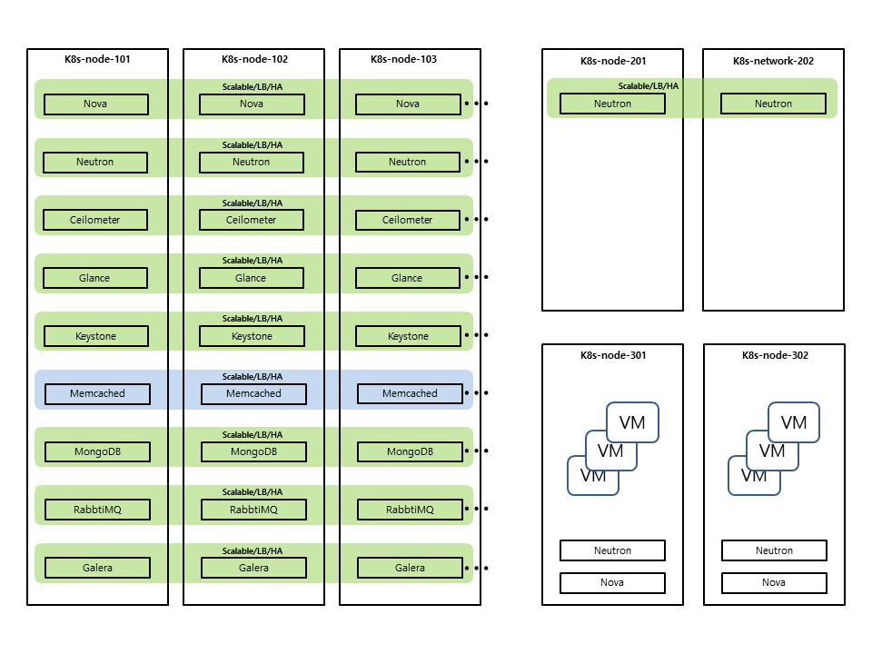

# OpenStack on Kubernetes (OaaS)

**(Note)**
* **This is not completed. now in developing...**
* OaaS is OpenStack as a Service

## Diagram

# Main Features

# v1.0

* Support OpenStack Controller Componet.
